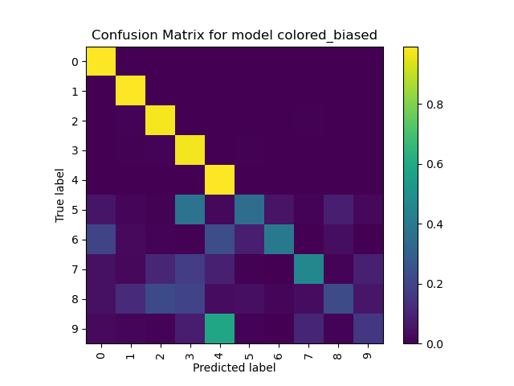
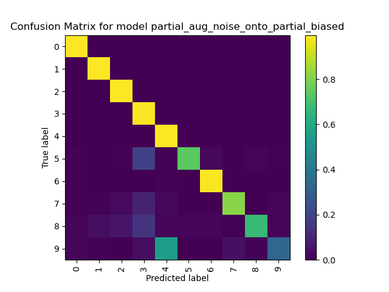

# MNIST Synthetic Experiments

### Dependencies
torchvision==0.7.0
torch==1.6.0

### Setup
If you only wish te run colored MNIST experiments, you don't need to do anything. The data set will be automatically downloaded for you.

If you wish to run the attack experiments (i.e. fgsm and cw), you will need to download `mnist.pkl` and `mnist.pkl` from [here](https://drive.google.com/file/d/10UOEiCy_cH2-2JMHg70NORIrevw7zxri/view?usp=sharing) and [here](https://drive.google.com/file/d/1Fau2edqzJ1uJfOMGfM3kSHuBAGnuJNfn/view?usp=sharing) and put them both in `data/` folder in the root directory of the project.

### Usage
See `./scripts`, `./scripts_temp` and `./scripts_reprod` for demos. Scripts in `./scripts_repord` are full pipelines which you can run and reproduce all results at once.
To see a full list of parameters, open `./args.py` or run `python args.py`

- To train a model, use `train.py`
- To evaluate a model, use `eval.py`
- To generate attacks or augmented dataset, use `generate_adversarial.py`
- To use paired training to continue fine-tuning a model, use `paired_train.py`
- To take a look at the generated images, use `show_image*.py`

### Colored Background Choices
- `basic` / `pure`: Meaning randomly choosing a color from a pool of 10 colors. Kind of unbiased, but is causing a lot of problems (see results). Pseudo code
  ```python
  colors = ['red', 'yellow', 'green', 'dark_blue', ..., 'pink']  # len(colors) == 10
  for img in images:
    color = colors[random_int(0, 10)] # randomly pick a color
    img.background.fill(color) # fill the background with the color
  ```
- `random_pure`: Similar to `basic` / `pure`, but instead we pick random RGB values. Pseudo code
  ```python
  for img in images:
    color = RGB(random_int(0,225), random_int(0,225), random_int(0,225)) # Truely pick a random color. We use 225 instead of 255 to avoid white background obfuscating the strokes.
    img.background.fill(color) # fill the background with the color

  ```
- `strips`: Fill the background with horizontal strips (two colors created by picking random RGB values).
- `noise`: Fill the background with random pixels (not pure colors any more).
- `mixture`: Mix the above augmentation methods to create a diverse data set. Pseudo code:
  ```python
  aug_methods = ['basic', 'random_pure', 'strips', 'noise']
  for img in images:
    aug_method = aug_methods[random_int(0, 4)] # randomly select an augmentation method
    img.background = get_background(aug_method) # generate a background with the method and alter the image
  ```
- `pure_*`: Use a single color to fill all images. The * part actually means the color we use. For example, `pure_13` means filling all images with `[225, 0, 225]`, `pure_23` means `[0, 225, 225]`, `pure_half_1` means `[128, 0, 0]`, etc.


### Caveats
To speed up experiments, the augmented data are pre-computed and stored. A full run of the colored experiments pipeline may require `10GB` of your disk space and fully occupies a `16GB` RAM with a little bit of virtual memory.


# Notes

Ideas, questions, outlines, results, etc.

## Thoughts on Catastrophic Forgetting and Biased Signals:

Is catastrophic forgetting always caused by biased signals?

When doing task A, then on the same task with input format perturbed (task A'), then performance on task A drops. Surely this is caused by biased signals, since the model is not really grasping the semantics, which is invariant in A and A'. Humans making predictions using pure semantics will perform perfectly in A' even if they are trained only on task A.  

On the other hand, when doing task A, then train on a different task B, then the performance drop may not be attributed to biased signals. This is because even humans cannot perform well on task B if they are only trained on task A (e.g. consider a kid who only trained to distinguish digit 1 and 2, one cannot expect him to know 3 or 4). In this case, catastrophic forgetting may not be attributed to biased signals, as task B is semantically different from task A. 

Therefore, whether catastrophic forgetting is caused by biased signals depends on whether the two tasks a model is trained on are semantically different or not. Furthermore, it is natural to think that the attribution to the biased signals is positively correlated to the degree of difference between two tasks. In other words, the more different in semantics two tasks are, the less we should say that the catastrophic forgetting issue is caused by the biased signals.

Interestingly, how tasks are semantically related is determined by human. If it is easier for human to transfer from task A to task A' than from task A to task B, then we may say that task A and A' are more semantically similar than task A and B.


## Experiment Results with Initial Setup
Pseudo code for dataset modification in the initial setup
```python
color_pool = [color0, color1, ..., color9]
```

```python
# Modify the training (and validation) set
for img, label in training_set:

  if label in [5, 6, 7, 8, 9]: # If sample is a biased digit

    # Fill the background with a designated color
    # This creates a color-digit correlation (bias)
    img.fill_background_with_color(color_pool[label])

  else: # If sample is an unbiased digit

    # Fill the background with a random color
    # from the color pool.
    n = random_int(0, 9) # Pick a random integer from 0 to 9
    img.fill_backgroud_with_color(color_pool[n])

# Modify the test set
for img, label in test_set:

    # Same as unbiased training samples, we 
    # pick a random color for test set.
    n = random_int(0, 9) 
    img.fill_backgroud_with_color(color_pool[n])

```
We train a biased model in the modified training set, and test on the modified test set. As expected, the confusion matrix looks like:



The digit-color correlation for digits 5 - 9 makes the model unable to digits 5 - 9 correctly.

We further pair-train it with `basic` augmentation (i.e. pair each image for a biased digit with a copy of itself, and the background of the copy will be filled with a random color **chosen from the pool**). **Note that we only augment images for biased digits. For an unbiased sample, we simply pair it with an exact copy of itself without changing anything.** This eliminates the bias completely, resulting in about 0.98 accuracy.

Interestingly, if we pair train it with `noise` augmentation (i.e. fill the backgrounds of paired images with random rgb values, or noise), we won't be able to optimize the performance (accuracy is about 0.85). The confusion matrix looks like this:



This also happens when we pair train with `strip` augmentation (i.e. fill the backgrounds with randomly-colored strips).

Why are `basic` augmentation better than `noise` and `strip` augmentations? One might say that `basic` augmentation resembles the test set most, since they both have pure-colored backgrounds from the same color pool. However, if we pair train using `basic` augmentation on a new test set with noise background, we will find out that it still reaches the best performance. This means that with proper augmentation, a model can learn to ignore any background, not just the once that are similar to the samples that it has seen before.


### Why does this happen?


## What Do We Want To Achieve?

### Final Goal

In real-life cases, we wish to augment the images in the training set with different backgrounds, so that the model can have a good performance on test set, despite the training set being biased. Before doing this, we use MNIST to test our ideas.

### Key Problems

- How do we create a dataset that is partially biased. This is easy. No need for discussion here. Simply associate some digits with some background colors)

- How do we augment the biased images, so that paired training results in better performance? Currently we have tried to fill the backgrounds with 

  - pure colors
  - strips
  - noises (RGB values that follows a uniform distribution)

  There are other methods we could try:

  - clipped Gaussian noise
  - Salt and Peper https://imgaug.readthedocs.io/en/latest/source/overview/arithmetic.html#coarsesaltandpepper

  In real life problems, we can also try a **cross-over** (maybe there is a proper word for this already). That is, augment one human-marked image with the background of other human-marked images. I believe these should be the most powerful augmentations, because compared to artificial noises or colors, they are much closer to the backgrounds of real images.

- How do we create a test set of these images? These should be different from how we generate augmented dataset. 

  - Try mixing the methods above with different parameters
  - Try using pure white background only.


### Synthetic Dataset

We use MNIST for easy experiments.

##### Test set

We first create an unbiased test set. 

Yet, there is one question: if we generate the background using a normal distribution, can we consider it as truly unbiased? For now I will assume the answer is yes, but I will also add something else that are unlikely to be generated by a normal distribution, such as strips and pure colors, just in case.

Another question (just out of curiosity): if we take all square pictures human beings have ever taken, clip or augment them to, let's say, 128*128, can we say that the each pixel value follow a normal distribution? If yes, do all pixel values follow the same normal distribution?


##### Training set

Half of the digits in the training set will be biased (i.e. each having a background with designated color, so that there is an absolute color-digit correlation). No questions here.

Originally, we made the other half unbiased. This was to test whether we need to feed the unbiased samples as well during augmented training. Since this has been confirmed, we do not need the other half to be unbiased. Yet we still do it in the original way. We use the same method to generate the backgrounds for unbiased training samples and test samples.

### Experiments

- (Tier 3) Alter the percentage of the augmented samples to see the effect of having more augmented samples. This gives a suggestion for people using the system on how much samples they need to mark by hand. However, this may not be necessary, as we pick the most biased ones and mark them first in the real system (by using influence function)
- ~~(Tier 1) Backgrounds of the test set and the augmented dataset can be strips, noise, pure color or a mixture of everything. We have in total 4 * 4 = 16 settings to experiment with. This is to answer the following questions:~~
  ~~Does a mixture of everything makes the test set harder than noise alone? I expect the answer to be yes, since pure colors cannot really be regarded as just special cases of noises, as previous experiments have shown.~~
- ~~(Tier 1) Try a test set with background in only 1 color, and look at the performance.~~
- ~~(Tier 2) Retrain base model, with the right unbiased digit setting. If that does not work, then there may be problems with the code.~~
- ~~(Tier 1) See accuracy for each color~~

### Summar


 